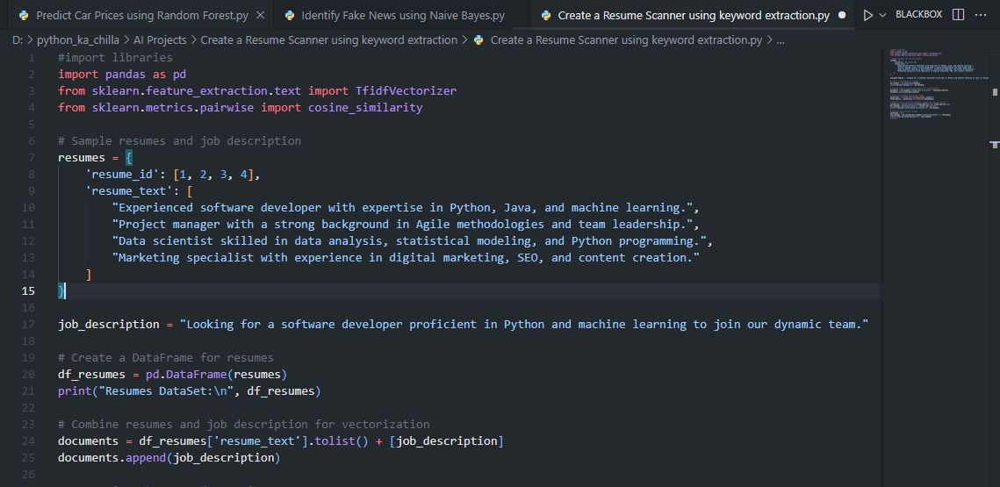
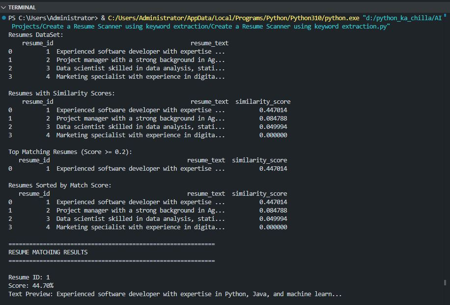

# 📄 Resume Scanner using TF-IDF | AI-Powered Resume Matching 🤖  
    

<p align="center">
  
</p>

🚀 The **Resume Scanner** is a Python application that uses **TF-IDF vectorization** and **cosine similarity** to automatically rank resumes against a job description. It helps recruiters quickly identify the most relevant candidates based on keyword matching and semantic similarity.

---

## ✨ Key Features  
📄 **Resume Parsing** – Processes multiple resumes from a sample dataset  
🔍 **TF-IDF Vectorization** – Converts text into numerical features  
📊 **Cosine Similarity** – Measures relevance between resumes and job description  
📈 **Ranking & Scoring** – Outputs similarity scores and sorts resumes  
🎯 **Best Match Identification** – Highlights the top candidate  
📝 **Easy to Extend** – Plug in your own resumes and job descriptions  

---

## 🧠 Tech Stack  
- **Language:** Python 🐍  
- **Libraries:** pandas 🐼, scikit-learn 🔢  
- **Techniques:** TF-IDF, Cosine Similarity  
- **Recommended IDE:** VS Code / PyCharm 💻  

---

## 📦 Installation  

```bash
git clone https://github.com/SayabArshad/Resume-Scanner-TFIDF.git
cd Resume-Scanner-TFIDF
pip install pandas scikit-learn
````

---

## ▶️ Usage

Run the main script:

```bash
python "Create a Resume Scanner using keyword extraction.py"
```

The script will:

Load sample resumes and a job description.

Compute TF-IDF vectors.

Calculate cosine similarity between each resume and the job description.

Display similarity scores, sort results, and print the best match.

---

## 📁 Project Structure

```
Resume-Scanner-TFIDF/
│-- Create a Resume Scanner using keyword extraction.py   # Main script
│-- README.md                                             # Documentation
│-- assets/                                               # Images for README
│    ├── code.JPG
│    └── output.JPG
```
---

## 🖼️ Interface Previews

| 📝 Code Snippet | 📊 Console Output |
|:---------------:|:-----------------:|
|  |  |

---

## 💡 About the Project

This project demonstrates how to build a simple yet effective resume screening tool using natural language processing techniques. By leveraging TF‑IDF and cosine similarity, it quantifies the relevance of each resume to a given job description. The approach is widely used in applicant tracking systems (ATS) to shortlist candidates. The code is well‑commented and easy to adapt for real‑world datasets.

---

## 🧑‍💻 Author

**Developed by:** [Sayab Arshad Soduzai](https://github.com/SayabArshad) 👨‍💻

📅 **Version:** 1.0.0

📜 **License:** MIT License

---

## ⭐ Contributions

Contributions are welcome! Fork the repository, open issues, or submit pull requests to enhance functionality (e.g., support for PDF parsing, more sophisticated NLP models, or a web interface).
If you find this project helpful, please ⭐ star the repository to show your support.

---

## 📧 Contact

For queries, collaborations, or feedback, reach out at **[sayabarshad789@gmail.com](mailto:sayabarshad789@gmail.com)**

---

📄 Streamlining recruitment with intelligent resume matching.vance.

---
